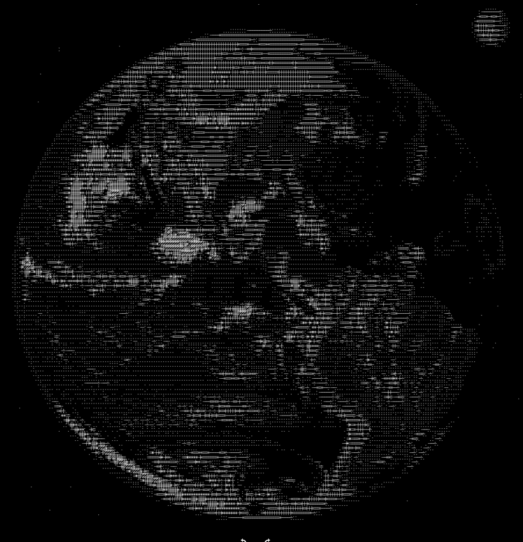

# 🎨 **ASCII Art Converter** (C++)




A high-performance command-line tool written in C++ that converts standard images into ASCII art. This project leverages OpenCV to process images, convert them to grayscale, and map pixel intensity to ASCII characters.

It not only outputs the ASCII art to the console and a text file but also renders the text back onto a new image file (.png), allowing you to share the result easily as a picture.


## 🚀 Features


Image Processing: Converts any image format supported by OpenCV (JPG, PNG, BMP, etc.) to grayscale.

Aspect Ratio Correction: Automatically adjusts dimensions to prevent the output from looking "stretched" due to the rectangular shape of terminal characters.

Multiple Output Formats:

- Console: Prints the result directly to the terminal.

- Text File: Saves the raw ASCII text to ascii_output.txt.

- Image Render: Generates a high-resolution ascii_output.png containing the drawn text.


## 📦 Prerequisites


This project depends on OpenCV (Open Source Computer Vision Library). Before building the project, you must install OpenCV on your system.

### 🐧 Linux (Debian/Ubuntu/Pop!_OS)

The easiest way is to use the package manager:
Bash

```bash
sudo apt update
sudo apt install libopencv-dev
```

### 🍎 macOS

If you have Homebrew installed, simply run:

```bash
brew install opencv
```

### 🪟 Windows

You have two options:

#### **Using vcpkg (Recommended):** 

```shell
vcpkg install opencv
```

#### **Pre-built Binaries:** 

Download from [OpenCV](https://opencv.org/releases/) Releases, extract them, and add the build folder to your System PATH.


## 🛠️ Build Instructions

This project uses CMake for an easy build process.

Clone the repository:

```bash
git clone <your-repo-url>
cd asciiConverter
```

Create a build directory and compile:

```bash
./build.sh
```


## 💻 Usage

To run the converter, you need to place your input image into the images/ folder in the project root directory.

**Prepare the folder:** Ensure you have a folder named images in the main project directory.
Plaintext

```
asciiConverter/
├── images/
│   └── my_photo.jpg
├── src/
├── CMakeLists.txt
└── ...
```

**Run the program:** Run the executable from the **`build folder`** and pass the filename (not the full path) as an argument:


## Syntax: 

```bash
./asciiConverter <filename_inside_images_folder> <resolution>
./asciiConverter my_photo.jpg 150
```

Check the output: The program will generate two files in your current directory:

    ascii_output.txt (The text version)

    ascii_output.png (The image version)


## 📁 File Structure

```bash
.
├── CMakeLists.txt          # Build configuration
├── README.md               # Documentation
├── images/                 # Place your input images here
│   └── example.jpg
├── src/
│   ├── main.cpp            # Entry point and file I/O logic
│   ├── ascii_converter.hpp # Header file for converter logic
│   └── (impl. files)       # Implementation details
└── build/                  # Compiled executables (created by user)
```