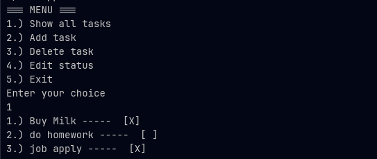

# 📝 C++ Terminal Todo List



A lightweight, file-based Todo application for the terminal. Built with C++, this tool allows you to efficiently manage tasks, track their status, and ensure your data is stored persistently.

## 🚀 Features

* **Persistent Storage:** Tasks are automatically loaded from and saved to `data.txt`.
* **Status Tracking:** Mark tasks as completed `[X]` or pending `[ ]`.
* **User-Friendly Interface:** Simple numbered menu for quick interaction.
* **Input Validation:** Robust handling of user input to prevent crashes (e.g., when entering characters instead of integers).

---

## 🛠 Tech Stack

* **Language:** C++11 or higher
* **Paradigm:** Object-Oriented Programming (Class-based logic)
* **Storage:** Flat-file database (`data.txt`)
* **Build System:** Makefile

---

## 📋 Menu Overview

| Option | Action | Description |
| :--- | :--- | :--- |
| `1` | **Show Tasks** | Displays all current tasks and their completion status. |
| `2` | **Add Task** | Creates a new entry in your list. |
| `3` | **Delete Task** | Removes a specific task using its index number. |
| `4` | **Edit Status** | Toggles a task between "Completed" and "Pending". |
| `5` | **Exit & Save** | Saves all changes to the local file and exits the program. |

---

## ⚙️ Installation & Usage

### Prerequisites
Ensure you have a C++ compiler (like `g++`) and `make` installed on your system.

### Build Commands
Use the provided Makefile for a seamless setup:

```bash
# Compile the project
make

# Compile and run immediately
make run

# Clean up (remove object files and executable)
make clean
```


## IMPORTANT!

**Directory Awareness**: The program requires data.txt to be in the working directory. If the file is missing or the program is executed from a different directory, it will exit with error code 101.

📁 File Structure

**main.cpp**: Entry point and menu loop logic.

**todo.cpp / todo.hpp**: Implementation of task management logic.

**data.txt**: Data storage (Format: [Status-Bit] [Task-Description]).

**Makefile**: Automation of the compilation process.

💡 Example Preview
```
=== MENU ===
1.) Show all tasks
2.) Add task
3.) Delete task
4.) Edit status
5.) Exit

Enter your choice: 1
1.) Create project README  ----- [X]
2.) Refactor C++ code      ----- [ ]
```